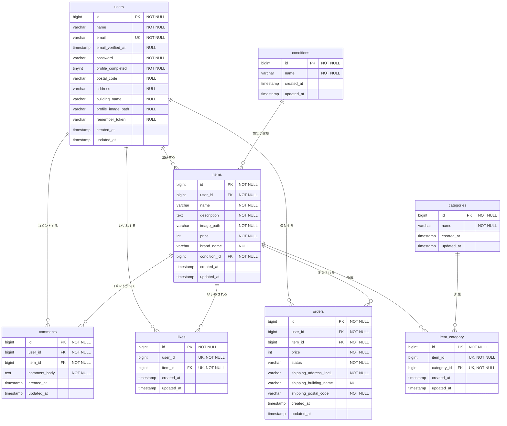

```mermaid
erDiagram
    users ||--o{ items : "出品する"
    users ||--o{ comments : "コメントする"
    users ||--o{ likes : "いいねする"
    users ||--o{ orders : "購入する"

    items ||--o{ comments : "コメントがつく"
    items ||--o{ likes : "いいねされる"
    items ||--o{ orders : "注文される"

    conditions ||--o{ items : "商品の状態"

    items ||--o{ item_category : "所属"
    categories ||--o{ item_category : "所属"

    users {
        bigint id PK "NOT NULL"
        varchar name "NOT NULL"
        varchar email UK "NOT NULL"
        timestamp email_verified_at "NULL"
        varchar password "NOT NULL"
        tinyint profile_completed "NOT NULL"
        varchar postal_code "NULL"
        varchar address "NULL"
        varchar building_name "NULL"
        varchar profile_image_path "NULL"
        varchar remember_token "NULL"
        timestamp created_at
        timestamp updated_at
    }

    items {
        bigint id PK "NOT NULL"
        bigint user_id FK "NOT NULL"
        varchar name "NOT NULL"
        text description "NOT NULL"
        varchar image_path "NOT NULL"
        int price "NOT NULL"
        varchar brand_name "NULL"
        bigint condition_id FK "NOT NULL"
        timestamp created_at
        timestamp updated_at
    }

    categories {
        bigint id PK "NOT NULL"
        varchar name "NOT NULL"
        timestamp created_at
        timestamp updated_at
    }

    item_category {
        bigint id PK "NOT NULL"
        bigint item_id "UK, NOT NULL"
        bigint category_id FK "UK, NOT NULL"
        timestamp created_at
        timestamp updated_at
    }

    comments {
        bigint id PK "NOT NULL"
        bigint user_id FK "NOT NULL"
        bigint item_id FK "NOT NULL"
        text comment_body "NOT NULL"
        timestamp created_at
        timestamp updated_at
    }

    conditions {
        bigint id PK "NOT NULL"
        varchar name "NOT NULL"
        timestamp created_at
        timestamp updated_at
    }

    likes {
        bigint id PK "NOT NULL"
        bigint user_id "UK, NOT NULL"
        bigint item_id FK "UK, NOT NULL"
        timestamp created_at
        timestamp updated_at
    }

    orders {
        bigint id PK "NOT NULL"
        bigint user_id FK "NOT NULL"
        bigint item_id FK "NOT NULL"
        int price "NOT NULL"
        varchar status "NOT NULL"
        varchar shipping_address_line1 "NOT NULL"
        varchar shipping_building_name "NULL"
        varchar shipping_postal_code "NOT NULL"
        timestamp created_at
        timestamp updated_at
    }
```
